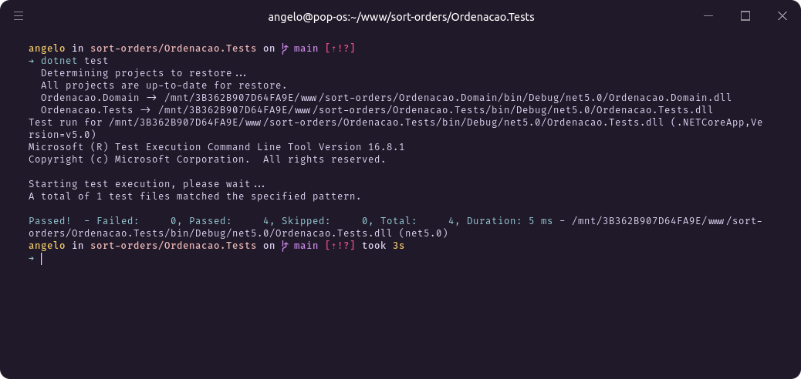

# Requisitos

- Ter a CLI do [GIT](https://git-scm.com/downloads)
- Ter instalada a [SDK do Dotnet Core](https://dotnet.microsoft.com/download)

# Como executar o projeto

Em uma janela do terminal, clone este repositório em alguma pasta do seu computador, na `desktop`, por exemplo, através do comando `git clone`:

```bash
git clone https://github.com/angeloevangelista/sort-orders.git
```

Abra a pasta e execute o comando `dotnet restore` em nas 3 pastas principais:

- Ordenacao.Domain
- Ordenacao.Tests
- Ordenacao.AppConsole

```bash
cd Ordenacao.Domain/
dotnet restore
cd ../

cd Ordenacao.Tests/
dotnet restore
cd ../

cd Ordenacao.AppConsole/
dotnet restore
```

Agora, ainda dentro de `Ordenacao.AppConsole`, basta executar `dotnet run` para executar a aplicação console.

# Recebendo produtos por CLI

O App ofereçe um opção de enviar produtos para o carrinho através da CLI, se não fornecidos, os produtos do arquivo [README](./README.md) serão utilizados.

Para passar os produtos, execute enviando-os no seguinte formato:

```bash
# Produto,Preco

dotnet run ProdutoX,PrecoX ProdutoY,PrecoY...
```

**Atenção**: Os preços são em decimal.

# Testes

Para testar a solução, navegue até o diretório `Ordenacao.Tests` e execute `dotnet test`:

<div align="center">



</div>
